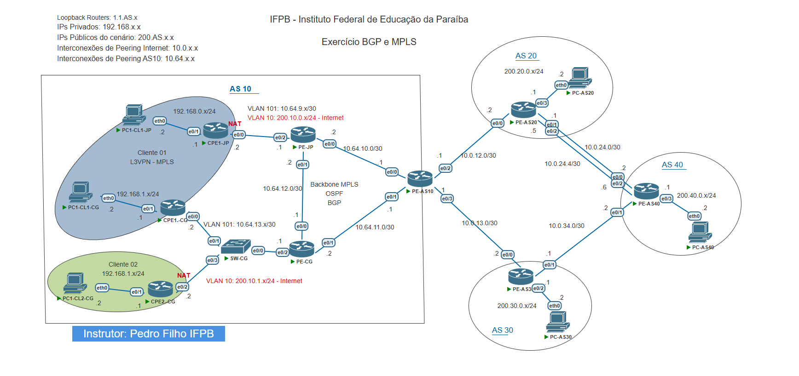
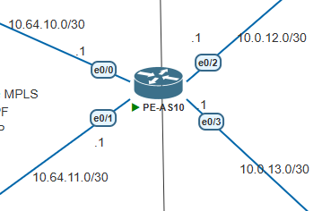
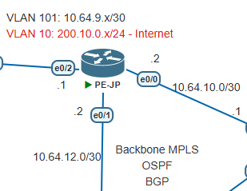
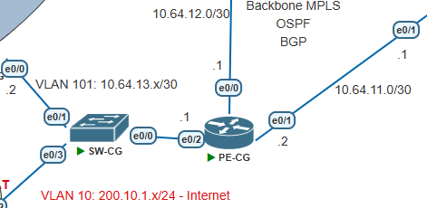
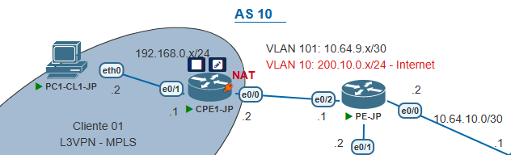
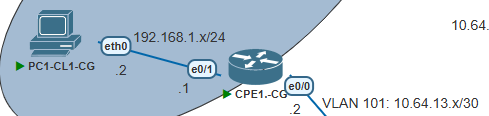
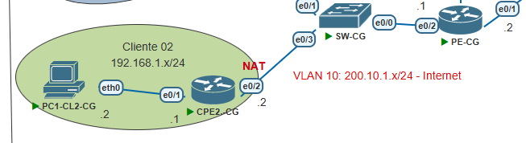
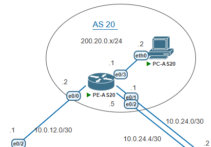
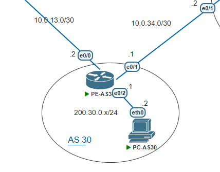
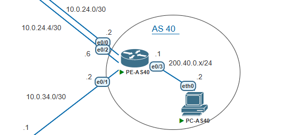

# Configurações de Rede - Topologia e Comandos Principais

## Informações dos Alunos
- **Aluno 1**: Lucas Vinicius Barbosa Candido de Oliveira (Matrícula: 20222380034)
- **Aluno 2**: Clebson Luiz da Silva (Matrícula: 20222380023)

## Topologia do Projeto



## Índice
1. [AS 10 - Configurações](#as-10---configurações)
   - [PE-AS10](#pe-as10)
   - [PE-JP](#pe-jp)
   - [PE-CG](#pe-cg)
   - [SW-CG](#sw-cg)
   - [CPE1-JP](#cpe1-jp)
   - [CPE1-CG](#cpe1-cg)
   - [CPE2-CG](#cpe2-cg)
2. [AS 20 - Configurações](#as-20---configurações)
   - [PE-AS20](#pe-as20)
3. [AS 30 - Configurações](#as-30---configurações)
   - [PE-AS30](#pe-as30)
4. [AS 40 - Configurações](#as-40---configurações)
   - [PE-AS40](#pe-as40)

---

## AS 10 - Configurações



### PE-AS10

**Informações Básicas**:
- **Hostname**: PE-AS10
- **Versão IOS**: 15.7

**Interfaces**:

| Interface   | Endereço IP   | Descrição                      |
| ----------- | ------------- | ------------------------------ |
| Loopback0   | 1.1.10.1/32   | Identificação do roteador      |
| Ethernet0/0 | 10.64.10.1/24 | OSPF point-to-point para PE-JP |
| Ethernet0/1 | 10.64.11.1/30 | OSPF point-to-point para PE-CG |
| Ethernet0/2 | 10.0.12.1/30  | Conexão para AS20              |
| Ethernet0/3 | 10.0.13.1/30  | Conexão para AS30              |

**Protocolos de Roteamento**:
1. **OSPF**:
   ```
   # Configuração OSPF
   router ospf 10
     mpls ldp autoconfig              # Habilita configuração automática de LDP para MPLS
     router-id 1.1.10.1               # ID do roteador
     auto-cost reference-bandwidth 10000  # Define largura de banda de referência
     network 1.1.10.1 0.0.0.0 area 0  # Anuncia rede Loopback em área 0
     network 10.64.10.0 0.0.0.3 area 0 # Anuncia rede para PE-JP em área 0
     network 10.64.11.0 0.0.0.3 area 0 # Anuncia rede para PE-CG em área 0
   ```

2. **BGP**:
   ```
   # Configuração BGP
   router bgp 10
     # Configuração de vizinhos internos (iBGP)
     neighbor 1.1.10.2 remote-as 10            # Vizinho PE-JP (mesmo AS)
     neighbor 1.1.10.2 update-source Loopback0 # Utiliza Loopback como fonte
     neighbor 1.1.10.3 remote-as 10            # Vizinho PE-CG (mesmo AS)
     neighbor 1.1.10.3 update-source Loopback0 # Utiliza Loopback como fonte
     
     # Configuração de vizinhos externos (eBGP)
     neighbor 10.0.12.2 remote-as 20           # Vizinho PE-AS20 (AS diferente)
     neighbor 10.0.13.2 remote-as 30           # Vizinho PE-AS30 (AS diferente)
     
     # Família de endereços IPv4
     address-family ipv4
       # Configurações para vizinhos internos
       neighbor 1.1.10.2 activate
       neighbor 1.1.10.2 next-hop-self         # Define-se como próximo salto
       neighbor 1.1.10.2 allowas-in            # Permite entrada de AS próprio
       neighbor 1.1.10.2 soft-reconfiguration inbound # Armazena atualizações recebidas
       
       neighbor 1.1.10.3 activate
       neighbor 1.1.10.3 next-hop-self
       neighbor 1.1.10.3 allowas-in
       neighbor 1.1.10.3 soft-reconfiguration inbound
       
       # Configurações para vizinhos externos
       neighbor 10.0.12.2 activate
       neighbor 10.0.12.2 soft-reconfiguration inbound
       neighbor 10.0.12.2 route-map PREPEND-1X out # Aplica prepend para saída
       
       neighbor 10.0.13.2 activate
       neighbor 10.0.13.2 soft-reconfiguration inbound
       neighbor 10.0.13.2 route-map PRIORIZA-AS30 in # Prioriza rotas de AS30
       neighbor 10.0.13.2 route-map AS10-OUT out    # Filtra rotas de saída
     exit-address-family
     
     # Família VPNv4 para MPLS VPN
     address-family vpnv4
       neighbor 1.1.10.2 activate
       neighbor 1.1.10.2 send-community both
       neighbor 1.1.10.2 next-hop-self
       neighbor 1.1.10.3 activate
       neighbor 1.1.10.3 send-community both
     exit-address-family
   ```

**Route-Maps e Prefix-Lists**:
```
# Prefix-lists
ip prefix-list AS10-PL seq 10 permit 200.10.0.0/24
ip prefix-list AS10-PL seq 15 permit 200.10.1.0/24
ip prefix-list PREFIX-AS40 seq 5 permit 200.40.0.0/24

# Route-maps
route-map PREPEND-1X permit 10
 match ip address prefix-list AS10-PL
 set as-path prepend 10                # Prepend AS próprio uma vez

route-map PRIORIZA-AS30 permit 10
 match ip address prefix-list PREFIX-AS40
 set local-preference 200              # Define preferência local alta (padrão: 100)

route-map AS10-OUT permit 10
 match ip address prefix-list AS10-PL  # Permite saída de prefixos específicos
```

### PE-JP


**Informações Básicas**:
- **Hostname**: PE-JP
- **Versão IOS**: 15.7

**VRF Definidas**:
```
# Definição de VRF para cliente
vrf definition CLIENTE-01
  rd 10:1                             # Route Distinguisher
  address-family ipv4
    route-target export 10:1          # Exporta comunidade
    route-target import 10:1          # Importa comunidade
  exit-address-family
```

**Interfaces**:

| Interface       | Endereço IP   | Descrição                        |
| --------------- | ------------- | -------------------------------- |
| Loopback0       | 1.1.10.2/32   | Identificação do roteador        |
| Ethernet0/0     | 10.64.10.2/30 | OSPF point-to-point para PE-AS10 |
| Ethernet0/1     | 10.64.12.2/30 | OSPF point-to-point para PE-CG   |
| Ethernet0/2.10  | 200.10.0.1/24 | VLAN 10 para cliente             |
| Ethernet0/2.101 | 10.64.9.1/30  | VLAN 101, VRF CLIENTE-01         |

**Protocolos de Roteamento**:
1. **OSPF**:
   ```
   router ospf 10
     mpls ldp autoconfig              # Habilita LDP para MPLS
     router-id 1.1.10.2               # ID do roteador
     auto-cost reference-bandwidth 10000
     network 1.1.10.2 0.0.0.0 area 0  # Loopback
     network 10.64.10.0 0.0.0.3 area 0 # Link para PE-AS10
     network 10.64.12.0 0.0.0.3 area 0 # Link para PE-CG
   ```

2. **BGP**:
   ```
   router bgp 10
     # Vizinhos internos
     neighbor 1.1.10.1 remote-as 10            # PE-AS10
     neighbor 1.1.10.3 remote-as 10            # PE-CG
     neighbor 1.1.10.3 update-source Loopback0
     
     # Vizinhos com cliente (CPE1-JP)
     neighbor 10.64.9.2 remote-as 65000        # Cliente na VRF
     neighbor 200.10.0.2 remote-as 65000       # Cliente em VLAN pública
     
     # Família IPv4 global
     address-family ipv4
       network 200.10.0.0                      # Anuncia rede pública
       neighbor 1.1.10.1 activate
       neighbor 1.1.10.3 activate
       neighbor 1.1.10.3 next-hop-self
       neighbor 10.64.9.2 activate
       neighbor 200.10.0.2 activate
       neighbor 200.10.0.2 route-map DENY-PVT in # Bloqueia redes privadas
     exit-address-family
     
     # Família VPNv4 (MPLS VPN)
     address-family vpnv4
       neighbor 1.1.10.1 activate
       neighbor 1.1.10.1 send-community both
       neighbor 1.1.10.3 activate
       neighbor 1.1.10.3 send-community extended
     exit-address-family
     
     # Família IPv4 para VRF CLIENTE-01
     address-family ipv4 vrf CLIENTE-01
       neighbor 10.64.9.2 remote-as 65000      # CPE dentro da VRF
       neighbor 10.64.9.2 activate
     exit-address-family
   ```

**Route-Maps e Prefix-Lists**:
```
ip prefix-list AS10-PL seq 5 permit 200.10.0.0/24
ip prefix-list PVT-PL seq 5 deny 192.168.0.0/16 # Bloqueia redes privadas

route-map DENY-PVT permit 10
  match ip address prefix-list PVT-PL          # Aplica filtro para redes privadas
```

### PE-CG



**Informações Básicas**:
- **Hostname**: PE-CG
- **Versão IOS**: 15.7

**VRF Definidas**:
```
vrf definition CLIENTE-01
  rd 10:1
  address-family ipv4
    route-target export 10:1
    route-target import 10:1
  exit-address-family
```

**Interfaces**:

| Interface       | Endereço IP   | Descrição                        |
| --------------- | ------------- | -------------------------------- |
| Loopback0       | 1.1.10.3/32   | Identificação do roteador        |
| Ethernet0/0     | 10.64.12.1/30 | OSPF point-to-point para PE-JP   |
| Ethernet0/1     | 10.64.11.2/30 | OSPF point-to-point para PE-AS10 |
| Ethernet0/2.10  | 200.10.1.1/24 | VLAN 10 para cliente             |
| Ethernet0/2.101 | 10.64.13.1/30 | VLAN 101, VRF CLIENTE-01         |

**Protocolos de Roteamento**:
1. **OSPF**:
   ```
   router ospf 10
     mpls ldp autoconfig
     router-id 1.1.10.3
     auto-cost reference-bandwidth 10000
     network 1.1.10.3 0.0.0.0 area 0      # Loopback
     network 10.64.11.0 0.0.0.3 area 0    # Link para PE-AS10
     network 10.64.12.0 0.0.0.3 area 0    # Link para PE-JP
   ```

2. **BGP**:
   ```
   router bgp 10
     # Vizinhos internos
     neighbor 1.1.10.1 remote-as 10            # PE-AS10 
     neighbor 1.1.10.2 remote-as 10            # PE-JP
     neighbor 1.1.10.2 update-source Loopback0
     
     # Vizinhos com clientes
     neighbor 10.64.13.2 remote-as 65000       # CPE1-CG (VRF)
     neighbor 200.10.1.2 remote-as 65001       # CPE2-CG
     
     # Família IPv4 global
     address-family ipv4
       redistribute connected                  # Redistribui redes conectadas
       neighbor 1.1.10.1 activate
       neighbor 1.1.10.2 activate
       neighbor 1.1.10.2 next-hop-self
       neighbor 1.1.10.2 soft-reconfiguration inbound
       neighbor 10.64.13.2 activate
       neighbor 200.10.1.2 activate
       neighbor 200.10.1.2 soft-reconfiguration inbound
     exit-address-family
     
     # Família VPNv4 para MPLS VPN
     address-family vpnv4
       neighbor 1.1.10.1 activate
       neighbor 1.1.10.1 send-community both
       neighbor 1.1.10.2 activate
       neighbor 1.1.10.2 send-community extended
     exit-address-family
     
     # Família IPv4 para VRF CLIENTE-01
     address-family ipv4 vrf CLIENTE-01
       neighbor 10.64.13.2 remote-as 65000     # CPE1-CG dentro da VRF
       neighbor 10.64.13.2 activate
     exit-address-family
   ```

### SW-CG

**Informações Básicas**:
- **Hostname**: SW-CG
- **Versão IOS**: 15.2

**VLANs Configuradas**:
- VLAN 10
- VLAN 101

**Interfaces**:

| Interface   | Modo         | Descrição     |
| ----------- | ------------ | ------------- |
| Ethernet0/0 | Trunk 802.1q | Conexão trunk |
| Ethernet0/1 | Trunk 802.1q | Conexão trunk |
| Ethernet0/2 | Trunk 802.1q | Conexão trunk |
| Ethernet0/3 | Trunk 802.1q | Conexão trunk |


### CPE1-JP



**Informações Básicas**:
- **Hostname**: CPE1-JP
- **Versão IOS**: 15.7

**Pool DHCP**:
```
ip dhcp excluded-address 192.168.0.1         # Exclui gateway do pool
ip dhcp pool POOL-DHCP
  network 192.168.0.0 255.255.255.0          # Rede local
  default-router 192.168.0.1                 # Gateway padrão
```

**Interfaces**:

| Interface       | Endereço IP    | Descrição                 |
| --------------- | -------------- | ------------------------- |
| Loopback0       | 1.1.10.4/32    | Identificação do roteador |
| Ethernet0/0.10  | 200.10.0.2/24  | VLAN 10, NAT outside      |
| Ethernet0/0.101 | 10.64.9.2/30   | VLAN 101 para VRF         |
| Ethernet0/1     | 192.168.0.1/24 | NAT inside, rede local    |

**Roteamento BGP**:
```
router bgp 65000
  neighbor 10.64.9.1 remote-as 10            # Conexão com PE-JP via VRF
  neighbor 200.10.0.1 remote-as 10           # Conexão com PE-JP via rede pública
  
  address-family ipv4
    network 192.168.0.0                      # Anuncia rede local
    neighbor 10.64.9.1 activate
    neighbor 10.64.9.1 allowas-in            # Aceita próprio AS em atualizações
    neighbor 200.10.0.1 activate
    neighbor 200.10.0.1 soft-reconfiguration inbound
  exit-address-family
```

**Configuração NAT**:
```
ip nat inside source list 10 interface Ethernet0/0.10 overload  # Ativa NAT overload
ip route 0.0.0.0 0.0.0.0 200.10.0.1                           # Rota padrão
access-list 10 permit 192.168.0.0 0.0.0.255                   # Lista de acesso para NAT
```

### CPE1-CG



**Informações Básicas**:
- **Hostname**: CPE1-CG
- **Versão IOS**: 15.7

**Pool DHCP**:
```
ip dhcp excluded-address 192.168.1.1
ip dhcp pool POOL-DHCP
  network 192.168.1.0 255.255.255.0
  default-router 192.168.1.1
```

| Interface       | Endereço IP    | Descrição                 |
| --------------- | -------------- | ------------------------- |
| Loopback0       | 1.1.10.5/32    | Identificação do roteador |
| Ethernet0/0.101 | 10.64.13.2/30  | VLAN 101 para VRF         |
| Ethernet0/1     | 192.168.1.1/24 | Rede local                |

**Roteamento BGP**:
```
router bgp 65000
  neighbor 10.64.13.1 remote-as 10           # Conexão com PE-CG via VRF
  
  address-family ipv4
    network 192.168.1.0                      # Anuncia rede local
    neighbor 10.64.13.1 activate
    neighbor 10.64.13.1 allowas-in           # Aceita próprio AS em atualizações
  exit-address-family
```

### CPE2-CG



**Informações Básicas**:
- **Hostname**: CPE2-CG
- **Versão IOS**: 15.7

**Pool DHCP**:
```
ip dhcp excluded-address 192.168.1.1
ip dhcp pool POOL-DHCP
  network 192.168.1.0 255.255.255.0
  default-router 192.168.1.1
```

**Interfaces**:

| Interface      | Endereço IP    | Descrição                 |
| -------------- | -------------- | ------------------------- |
| Loopback0      | 1.1.10.6/32    | Identificação do roteador |
| Ethernet0/1    | 192.168.1.1/24 | NAT inside, rede local    |
| Ethernet0/2.10 | 200.10.1.2/24  | VLAN 10, NAT outside      |

**Roteamento BGP**:
```
router bgp 65001
  neighbor 200.10.1.1 remote-as 10           # Conexão com PE-CG
  
  address-family ipv4
    neighbor 200.10.1.1 activate
    neighbor 200.10.1.1 soft-reconfiguration inbound
  exit-address-family
```

**Configuração NAT**:
```
ip nat inside source list 10 interface Ethernet0/2.10 overload  # Ativa NAT overload
ip route 0.0.0.0 0.0.0.0 200.10.1.1                           # Rota padrão
access-list 10 permit 192.168.1.0 0.0.0.255                   # Lista de acesso para NAT
```

---

## AS 20 - Configurações



### PE-AS20

**Informações Básicas**:
- **Hostname**: PE-AS20
- **Versão IOS**: 15.7

**Interfaces**:

| Interface   | Endereço IP   | Descrição                     |
| ----------- | ------------- | ----------------------------- |
| Loopback0   | 1.1.20.1/32   | Identificação do roteador     |
| Ethernet0/0 | 10.0.12.2/30  | Conexão para AS10             |
| Ethernet0/1 | 10.0.24.1/30  | Conexão para AS40             |
| Ethernet0/2 | 10.0.24.5/30  | Conexão alternativa para AS40 |
| Ethernet0/3 | 200.20.0.1/24 | Rede pública                  |

**Roteamento BGP**:
```
router bgp 20
  neighbor 1.1.40.1 remote-as 40             # Vizinho PE-AS40 (Loopback)
  neighbor 1.1.40.1 ttl-security hops 2      # Segurança com TTL
  neighbor 1.1.40.1 update-source Loopback0  # Usa Loopback como fonte
  neighbor 10.0.12.1 remote-as 10            # Vizinho PE-AS10
  
  address-family ipv4
    network 200.20.0.0                       # Anuncia rede pública
    neighbor 1.1.40.1 activate
    neighbor 1.1.40.1 soft-reconfiguration inbound
    neighbor 10.0.12.1 activate
    neighbor 10.0.12.1 soft-reconfiguration inbound
  exit-address-family
```

**Rotas Estáticas**:
```
ip route 1.1.40.1 255.255.255.255 10.0.24.2    # Rota para Loopback de PE-AS40
ip route 1.1.40.1 255.255.255.255 10.0.24.6    # Rota alternativa
```

---

## AS 30 - Configurações


### PE-AS30

**Informações Básicas**:
- **Hostname**: PE-AS30
- **Versão IOS**: 15.7

**Interfaces**:

| Interface   | Endereço IP   | Descrição                 |
| ----------- | ------------- | ------------------------- |
| Loopback0   | 1.1.30.1/32   | Identificação do roteador |
| Ethernet0/0 | 10.0.13.2/30  | Conexão para AS10         |
| Ethernet0/1 | 10.0.34.1/30  | Conexão para AS40         |
| Ethernet0/2 | 200.30.0.1/24 | Rede pública              |

**Roteamento BGP**:
```
router bgp 30
  neighbor 10.0.13.1 remote-as 10            # Vizinho PE-AS10
  neighbor 10.0.34.2 remote-as 40            # Vizinho PE-AS40
  
  address-family ipv4
    network 200.30.0.0                       # Anuncia rede pública
    neighbor 10.0.13.1 activate
    neighbor 10.0.13.1 soft-reconfiguration inbound
    neighbor 10.0.34.2 activate
    neighbor 10.0.34.2 soft-reconfiguration inbound
  exit-address-family
```

---

## AS 40 - Configurações


### PE-AS40

**Informações Básicas**:
- **Hostname**: PE-AS40
- **Versão IOS**: 15.7

**Interfaces**:

| Interface   | Endereço IP   | Descrição                     |
| ----------- | ------------- | ----------------------------- |
| Loopback0   | 1.1.40.1/32   | Identificação do roteador     |
| Ethernet0/0 | 10.0.24.2/30  | Conexão para AS20             |
| Ethernet0/1 | 10.0.34.2/30  | Conexão para AS30             |
| Ethernet0/2 | 10.0.24.6/30  | Conexão alternativa para AS20 |
| Ethernet0/3 | 200.40.0.1/24 | Rede pública                  |

**Roteamento BGP**:
```
router bgp 40
  neighbor 1.1.20.1 remote-as 20             # Vizinho PE-AS20 (Loopback)
  neighbor 1.1.20.1 ttl-security hops 2      # Segurança com TTL
  neighbor 1.1.20.1 update-source Loopback0  # Usa Loopback como fonte
  neighbor 10.0.34.1 remote-as 30            # Vizinho PE-AS30
  
  address-family ipv4
    network 200.40.0.0                       # Anuncia rede pública
    neighbor 1.1.20.1 activate
    neighbor 1.1.20.1 soft-reconfiguration inbound
    neighbor 10.0.34.1 activate
    neighbor 10.0.34.1 soft-reconfiguration inbound
  exit-address-family
```

**Rotas Estáticas**:
```
ip route 1.1.20.1 255.255.255.255 10.0.24.1    # Rota para Loopback de PE-AS20
ip route 1.1.20.1 255.255.255.255 10.0.24.5    # Rota alternativa
```
